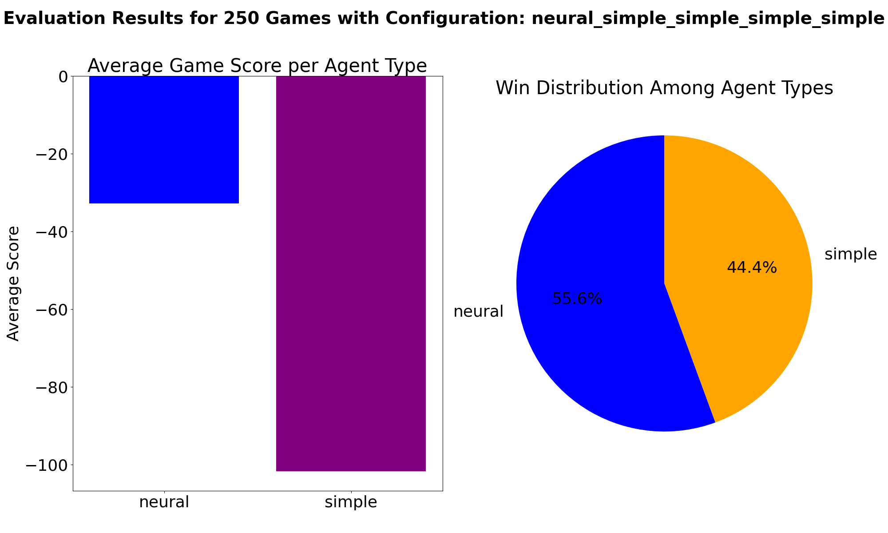

# Skull King Reinforcement Learning

## Overview
This project implements a reinforcement learning environment for the card game Skull King using the OpenAI Gym interface. The environment is designed to simulate the game mechanics, allowing agents to learn strategies for bidding and playing cards.

Note: The project has two main branches. The PAC branch explores a policy-based approach with an attempt at actor-critic, while the ReBel branch reimplements the ReBel algorithm for Skull King. 

Although we use the rules of the game, we do not represent blackrock games or replicate the actual game of Skull King.


## Conclusion

The PAC method outputs an agent that seemingly learns to not lose any points by the end of the game, as its average final score hovers around 0.

Assets images for evaluation results:


The model converges relatively quickly when training 5 agent to learn through self play. These 5 agents have a shared model that is punished /rewarded by all of their scores. 
tge reward you ee in this graph that hovers around 0 for each game (episode) is the sum of scores of all 5 agents. (almost as if the model was trying to keep it to 0 ? we do not know this may be a mistake on ou part)


We quickly noticed the model had trouble faring in 4-player games... after all, all it even knew were 5 player games. Here it struggles to dominate a randomized agent (simpleAgent) in a series of "2v2" games.

It's then quite awkward to evaluate with our baseline agent models which use hardcoded logic operations.



We can only then use 5-player based evaluation games and the method of choice was to see how well an agent would fare against 4 agents of the other type.


We see than when switching roles, Neural agents holds up better than intermediate agent which gets beaten more.

The most telling metric however is the average score per game for Neural agent. an average score we would have like to be ideal.

Theoretically the maximum amount of points obtainable by an agent is 550 but it's almost impossible since we use no special cards.

## Files
- **env/SKEnvNoSpecials.py**: Defines the `SkullKingEnvNoSpecials` class, which implements the Skull King game environment. It includes methods for creating the deck, dealing cards, resetting the environment, taking steps in the game, resolving tricks, calculating rewards, and transitioning to the next round.

- **agent/agent.py**: Contains the implementation of the agent that interacts with the `SkullKingEnvNoSpecials` environment. The agent will employ strategies for bidding and playing cards based on the current state of the game. The action space is dynamically adjusted to accommodate the varying number of cards each player has.

- **main.py**: The entry point for the project. This file initializes the environment and the agent, runs the game loop, and manages the interaction between the agent and the environment.

- **requirements.txt**: Lists the dependencies required for the project, including `gym` and `numpy`.

## Game Rules
1. **Dealing Phase**: 
   - Shuffle the deck.
   - Deal `round_number` cards to each player.
   - Initialize the bidding phase.

2. **Bidding Phase**: 
   - Each player chooses a bid (0 to `round_number`).
   - Store bids and transition to the trick-playing phase.

3. **Trick-Playing Phase**: 
   - Players play tricks following the Skull King rules.
   - Determine trick winners and track the number of tricks won.

4. **Scoring Phase**: 
   - Compute rewards based on bid accuracy.
   - Move to the next round.

## Setup Instructions
1. Clone the repository:
   ```
   git clone <repository-url>
   cd skull-king-rl
   ```

2. Install the required dependencies and make the project editable:
   ```
   pip install -r requirements.txt
   pip install -e .
   ```

3. Launch an experiment:
   ```
   python main.py --num_episodes 1000 --num_players 5 --agent_types learning learning learning learning learning --shared_networks --play_hidden_dims 128 128 128 128 --bid_hidden_dims 128 128 128 128 --enable_tensorboard
   ```

4. Run the evaluation script:
   ```
   python evaluate_agent.py --models_path $PATH_OF_EXPERIMENT --n_eval_games 250 --num_players 5 --shared_networks --play_hidden_dims 128 128 128 128 --bid_hidden_dims 128 128 128 128 --agents neural intermediate intermediate intermediate intermediate
   ```

Note: Ensure that the hidden dimensions (i.e., the number of layers and sizes) and the number of agents remain consistent between the main experiment and evaluation commands.

## Running the Agent
To run the agent within the environment, ensure that the agent's logic is implemented in `agent/agent.py`. The agent will interact with the `SkullKingEnvNoSpecials` environment, making decisions based on the current game state.
